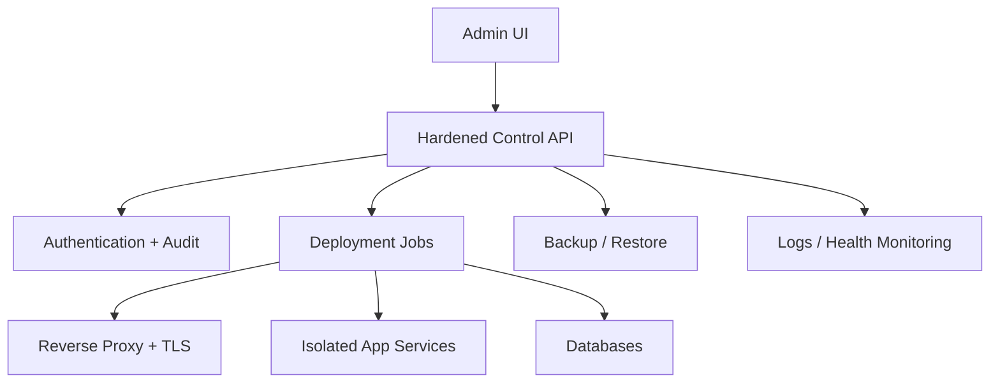

# Atulya Host

> **A simple self-hosting panel for websites, APIs and AI applications.** ☁️🚀

Atulya Host is the planned infrastructure module of the Atulya family: deploy business tools, web apps, Python APIs and AI dashboards on infrastructure you control.

> 🚧 Architecture stage only. A server control panel should not be exposed publicly until security review, hardening, update handling and backup testing are complete.

## 🚀 Product Focus

Rather than cloning every hosting-panel feature, Atulya Host will focus first on safe deployment of modern apps:

| Workflow | Planned outcome |
|---|---|
| Deploy a Python dashboard | Managed process, domain routing, logs and restart |
| Deploy an API | Reverse proxy, environment variables and HTTPS |
| Deploy static/Node app | Build and publish with controlled configuration |
| Back up application data | Scheduled encrypted backups and restore testing |
| Host Atulya modules | Team-accessible ERP/GST/HR workspace deployment |

## 🏗️ Architecture

## 🖥️ Planned Setup

| Environment | Plan |
|---|---|
| Ubuntu/Debian server | Guided one-command bootstrap after security baseline exists |
| Docker Compose | Repeatable local evaluation and development |
| Desktop OS | Administration client only, not production hosting |

## 🔐 Security Gate Before Release

- Strong authentication, secure session management and least-privilege service execution.
- HTTPS/TLS provisioning and secure secrets storage.
- Isolated apps, restricted file access and safe command execution.
- Signed updates, backup restore tests, audit logs and documented threat model.
- Independent security review before describing it as production-ready.

## 🗺️ Roadmap

| Phase | Delivery |
|---|---|
| 1 | Threat model, architecture and Docker-based development environment |
| 2 | Local-only dashboard for app status and logs |
| 3 | Deployment of static and Python demo applications |
| 4 | TLS, backups, databases and hardened authentication |
| 5 | Security review, guided server installer and Atulya app hosting |

## 🔗 Ecosystem

[Atulya One](https://github.com/atulyaai/Atulya-Automation-Hub) · [Atulya ERP](https://github.com/atulyaai/Atulya-Accounting-ERP) · [Atulya GST](https://github.com/atulyaai/Atulya-GST-Suite) · [Atulya HR](https://github.com/atulyaai/Atulya-HR-Suite)

## 📜 License

MIT planned for the open-source core.
