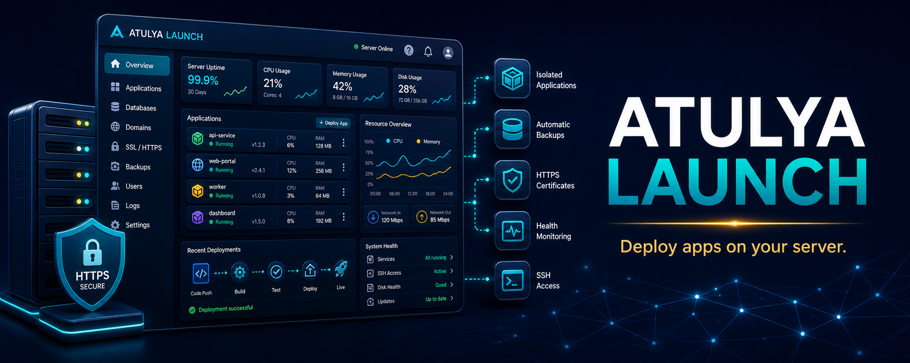

# Atulya Launch



Atulya Launch is a **self-hosted server management panel** and CLI for managing
websites, databases, email, DNS, SSL, firewalls, Docker containers, and more.
It is designed as a lightweight, open-source alternative to cPanel, Plesk,
HestiaCP, and aaPanel.

> **Status: feature-complete MVP, hardening for clean-host install.** The panel
> ships a working FastAPI app, CLI, full auth/session/2FA layer, audit logging,
> 596 mounted routes across 33 feature groups, and **109 passing tests** (75s).
> Phase 3 services are implemented for mail (Postfix/Dovecot/OpenDKIM), SSL
> (Let's Encrypt + wildcard DNS-01), SSH terminal (asyncssh + WebSocket), and
> Nginx config. Remaining work before a public "production cPanel replacement"
> claim: clean-host install validation, security audit, signed releases, and
> macOS/Windows driver implementation.

## What's Included

### Web Dashboard (FastAPI)
- Secure login with session cookies and bearer token API auth
- Full dashboard with system metrics, sites, backups, security score
- Dark-themed responsive UI

### Website Management
- Create/list/delete websites with automatic Nginx config generation
- Reverse proxy support, PHP-FPM blocks
- Nginx config apply/test/reload workflow (Linux)

### DNS Management
- DNS zone and record management (A, AAAA, CNAME, MX, TXT, NS, SRV)
- SQLite-backed persistent storage

### Email Management
- Create/delete email accounts with password hashing
- Quota management

### Database Management
- MySQL/MariaDB/PostgreSQL create/drop/backup
- Web UI for database lifecycle

### SSL/TLS Certificates
- Let's Encrypt certificate issuance and renewal via Certbot
- Certificate tracking in the panel

### File Manager
- Browse, upload, create directories, delete files within site web roots
- Path traversal protection (stays inside allowed directories)

### Backup System
- Create/list/restore zip archives of config + webroots
- Audit logging for all backup operations

### System Monitoring
- Live CPU, RAM, disk, network metrics (auto-refresh)
- Top processes by CPU/memory
- Service status (Nginx, MySQL, PostgreSQL, Redis, Fail2Ban, SSH)

### Firewall & Security
- UFW enable/disable/allow/deny
- Fail2Ban status and restart
- Security scan with scoring (checks bind host, API token, web roots)

### Docker Management
- One-click deploy: Nginx, MySQL, PostgreSQL, Redis, WordPress, Nextcloud, phpMyAdmin, Adminer, Portainer
- Container start/stop/remove
- Image listing

### App Installer
- WordPress, Nextcloud, Laravel, Ghost, Flask, Django templates
- Domain-based installation tracking

### Multi-User / RBAC
- User creation with admin/user roles
- Password change with current-password verification
- Admin-only user management

### CLI (Click)
- 25+ commands: `init`, `site`, `backup`, `files`, `database`, `ssl`, `firewall`, `audit`, `security-scan`, `serve`, `list`, `install`, `update`, `status`, `system`, `releases`, `self-update`

### Production Installer
- One-command Ubuntu server installer (`scripts/install-server.sh`)
- Installs: Python 3.11, Nginx, MySQL, PHP-FPM, Certbot, UFW, Fail2Ban, Docker
- Creates systemd service for auto-start

### Audit Logging
- JSONL-based audit log for every write action
- Login attempts, site changes, file operations, backups

### Security
- PBKDF2-SHA256 password hashing (200k iterations)
- Session tokens with expiry
- Bearer token API authentication
- Path traversal protection on file operations
- Archive extraction path safety
- Secrets excluded from git

## Install

### Quick Start (Development)

```bash
git clone https://github.com/atulyaai/Atulya-Launch.git
cd Atulya-Launch
python -m pip install -e ".[all]"
```

### With Web Dependencies

```bash
python -m pip install -e ".[web]"
```

### Production Server (Ubuntu)

```bash
sudo bash scripts/install-server.sh
```

Environment variables:
- `PANEL_HOST` - Bind host (default: 127.0.0.1)
- `PANEL_PORT` - Bind port (default: 8080)
- `ADMIN_USER` - Admin username (default: admin)
- `ADMIN_PASS` - Admin password (auto-generated if empty)
- `SKIP_DOCKER=1` - Skip Docker installation

## Usage

### Start the Web Panel

```bash
atulya-launch serve
# or
python -m atulya_launch serve --host 0.0.0.0 --port 8080
```

Open `http://localhost:8080` and log in with admin/admin.

### CLI Examples

```bash
# System status
atulya-launch system

# Manage websites
atulya-launch site create example.com
atulya-launch site list
atulya-launch site delete example.com

# Databases
atulya-launch database create mydb --type mysql
atulya-launch database backup mydb --type mysql

# SSL certificates
atulya-launch ssl issue example.com
atulya-launch ssl renew example.com

# Firewall
atulya-launch firewall status
atulya-launch firewall allow 443 --proto tcp

# Security scan
atulya-launch security-scan

# Audit log
atulya-launch audit

# Backup
atulya-launch backup create
atulya-launch backup list
atulya-launch backup restore <name>
```

### API

```bash
# Login
curl -X POST http://localhost:8080/api/auth/login \
  -H "Content-Type: application/json" \
  -d '{"username":"admin","password":"admin"}'

# Use token
curl -H "Authorization: Bearer <token>" http://localhost:8080/api/sites
```

## Architecture

```
atulya_launch/
  __init__.py          # Version, tool catalog
  __main__.py          # Module entry point
  cli.py               # Click CLI (25+ commands)
  core.py              # Core logic: sites, backups, SSL, firewall, monitoring
  utils.py             # Platform helpers, template rendering
  docker.py            # Docker container management
  drivers/             # OS driver scaffold: Linux, macOS, Windows
  web/
    __init__.py
    app.py             # FastAPI application factory
    auth.py            # Password hashing, sessions, RBAC decorators
    database.py        # SQLite schema, connection management
    routes/
      dashboard.py     # Dashboard page
      sites.py         # Website CRUD
      dns.py           # DNS zones and records
      email.py         # Email account management
      databases.py     # Database management
      ssl.py           # SSL certificate management
      files.py         # File manager
      backups.py       # Backup create/restore
      monitoring.py    # Live system metrics
      firewall.py      # UFW and Fail2Ban
      apps.py          # App installer
      docker.py        # Docker container management
      settings.py      # User management, panel config
templates/             # Jinja2 HTML templates
tests/                 # 59 tests (unit + integration + web)
scripts/               # Installers (bash, PowerShell, Python)
```

### Production Driver Scaffold

The Phase 2 driver layer lives in `atulya_launch/drivers`.

- Linux: systemd, apt, Nginx, BIND, Postfix, Dovecot.
- macOS: launchd, Homebrew, Caddy-first web serving.
- Windows: Windows services, winget, Caddy-first web serving.

Drivers default to dry-run planning so feature modules can be migrated safely
from ad hoc service commands to a single production integration boundary.

## Testing

```bash
pytest tests/ -v
```

### Test Coverage

| Test File | Tests | Covers |
| --- | --- | --- |
| `test_core_mvp.py` | 10 | Panel init, sites, backups, security, file manager, audit |
| `test_core_extended.py` | 20 | Nginx plans, security scan, file operations, domain validation |
| `test_auth.py` | 9 | Password hashing, user creation, authentication, sessions |
| `test_database.py` | 9 | SQLite schema, CRUD for zones/records/email/DBs/SSL/audit |
| `test_web.py` | 10 | Login flow, session cookies, API auth, dashboard access |
| `test_installer.py` | 1 | Installer dry-run |

## Security

### In Scope

- Authentication or authorization bypass
- Remote code execution, command injection
- Path traversal or arbitrary file read/write
- Privilege escalation
- Secret leakage
- SSRF, CSRF, XSS, SQL injection
- Backup/restore/archive/file-manager vulnerabilities

### Reporting

Use GitHub private vulnerability reporting. Include: affected version,
reproduction steps, impact, and suggested fix.

## What's New in v1.0.0

### Production Hardening

- Rate limiter on login (5 attempts/5min per IP, 429 response).
- Account lockout (10 failed attempts/15min per username).
- Password policy (min 8 chars, mixed case, digit).
- Max 5 concurrent sessions per user.
- Secure cookie attributes (httponly, samesite, secure with `PANEL_HTTPS`).
- Global exception handler with `PANEL_DEBUG` opt-in for stack traces.
- Database schema versioning (`SCHEMA_VERSION=2`).
- `safe_write()` with umask 022 + chmod on Linux.

### Migration Import

- Import sites, databases, and emails from cPanel/Plesk/HestiaCP archives.

### Reseller Plans

- Create hosting plans with site/disk/DB/email/bandwidth limits.
- Assign plans to users; limit enforcement on creation.

### WordPress One-Click Installer

- Downloads latest WordPress, generates `wp-config.php`, optionally auto-creates MySQL database.

### App Deployment (Node.js/Python)

- Deploy Node.js/Python apps with Nginx reverse proxy.
- Start/stop application processes.

### Cron Job Management

- Create, delete, toggle cron jobs with custom schedules.

### Log Viewer

- View Nginx access/error, panel audit, system, and auth logs.
- Filter by grep expression; adjustable line count.

### Security Audit

- Comprehensive audit: score (0–100) checking firewall, Fail2Ban, Nginx config, default users, bind address.

### Load Testing

- Concurrent HTTP load testing tool with real-time results.

### Multi-Server Management

- Add remote servers (password or SSH key auth).
- Execute commands remotely via the panel.

### Branding / White-Label

- Customize panel name and primary color from Settings.

### SSH Terminal (in-browser)

- asyncssh-backed PTY over WebSocket with session tracking and audit.

### Wildcard SSL (Let's Encrypt DNS-01)

- Wildcard cert issuance and renewal for `*.domain.com` via DNS-01 challenge.

### ModSecurity WAF

- Custom rules, SQLite-backed config, OWASP CRS loader (DetectionOnly default).

### Additional features shipping in 1.0.0

- 2FA (TOTP), login history, IP allow/deny, hotlink protection
- DKIM key generation, email forwarding/auto-responders/routing
- FTP, SFTP isolation, SSH access control
- Bandwidth tracking + per-user quotas, resource history
- Cloudflare + generic cloud DNS integration
- Subdomains, redirects, error pages, staging environments
- IPv6 management, timezone, status page, notifications
- API token scopes, plugin system (analytics, antivirus, cms_installer, webmail)
- Backups: S3, encryption, scheduled DB backups, cloud backup, import/export
- Nginx cache, Redis cache, OpenCache, phpMyAdmin installer, port scanner
- VPN management, Node.js + Python app deploy, Git deploy

## License

MIT License. See [LICENSE](LICENSE).
